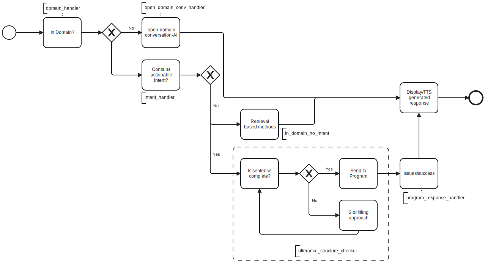

# Speech System

### Running through dockers

Install docker setup https://docs.docker.com/get-docker/
Start the docker service

- Navigate to ./code/frontend and execute the following command in terminal
  docker build -t verbbot-frontend .
- Navigate to ./code/back and execute the following command in terminal
  docker build -t verbbot-frontend .
- Navigate back to ./ code directory and run the following command
  docker-compose up

dialogue backend is running on localhost:5000

Access frontend(dialogue-ui) at: localhost:3308

### Running from source

#### Frontend:

- Install node.js if not available
- Navigate to ./code/frontend and execute the following commands in terminal
  ```
  npm install
  npm start
  ```
  This should start frontend, the port number would be mentioned on the terminal from where you ran the above command
  access the frontend on chrome browser at localhost:<port_number> (e.g localhost:3306)

#### Backend:

- Install python 3.6 and above if not installed
- Navigate to ./code/back and execute the following commands in terminal

  ```
  pip install --no-cache-dir -r requirements.txt
  python -m spacy download en_core_web_sm
  python -m spacy download en_core_web_trf
  python -m spacy download en_core_web_lg
  python -m coreferee install en

  python endpoint.py
  ```

  Although above steps can be executed as a script, but in each of the above commands are bulky and takes time to finish and executing them one by one makes it easier to figure out where the issue occured in case of an error.

  This should start backend at localhost:5000.

- In case you want to use OpenAI for the social dialogue generation:
  - Get openai api key from [OPENAI](https://platform.openai.com/account/api-keys).
  - Create environment variable OPENAI_API_KEY.
  - Assign it key generated from openai portal.
  - This is to be done before you start the python endpoint.

## Dialogue Pipeline



Python packages(folders) are created as per the pipeline
